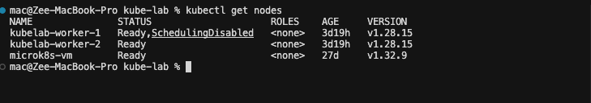

# Drain Node

Cordons one worker node (no new pods), then evicts all its pods gracefully to other nodes.

**Before clicking**: open two terminals:
```bash
# Terminal 1
kubectl get pods -n kubelab -o wide -w

# Terminal 2
kubectl get nodes -w
```

## What You'll See



```
# Terminal 1 — pods move from worker-1 to worker-2
NAME                       STATUS        NODE
backend-6d4f8b9c7-xk2qp   Terminating   kubelab-worker-1
backend-6d4f8b9c7-rp9ms   Running       kubelab-worker-2   ← replacement

# Terminal 2 — node status changes
NAME              STATUS                     ROLES
kubelab-worker-1  Ready,SchedulingDisabled   worker     ← cordoned
```

After the simulation, click **Uncordon** in the dashboard. Or:
```bash
kubectl uncordon kubelab-worker-1
```

## What Happened

1. Cordon: `spec.unschedulable=true` written on the node — scheduler immediately skips it
2. For each non-DaemonSet pod: Kubernetes posts an Eviction object (goes through PDB policy check)
3. PodDisruptionBudget check: if eviction would violate `minAvailable`, the eviction is blocked until safe
4. Eviction proceeds: `deletionTimestamp` set, SIGTERM sent, grace period respected
5. All evicted pods enter Pending simultaneously — scheduler races to place them on worker-2
6. Node stays `SchedulingDisabled` until you uncordon — Kubernetes will not restore it automatically

## The Hidden HA Gap

```bash
kubectl get pods -n kubelab -o wide | grep backend
```

If both backend pods show the **same NODE** — draining that node evicts both simultaneously. `replicas: 2` provides zero protection if they colocate. Fix: pod anti-affinity with `topologyKey: kubernetes.io/hostname`.

## Verify

```bash
kubectl get nodes                      # SchedulingDisabled on drained node
kubectl get pods -n kubelab -o wide    # All pods on remaining worker
kubectl get pods -n kubelab | grep Pending   # Should be empty after ~30s
```

If pods stay Pending: remaining node may lack capacity. `kubectl describe pod <pending>` → Events section shows scheduler reason.

**Back**: [Kill Pod ←](pod-kill.md) · **Next**: [CPU Stress →](cpu-stress.md)

