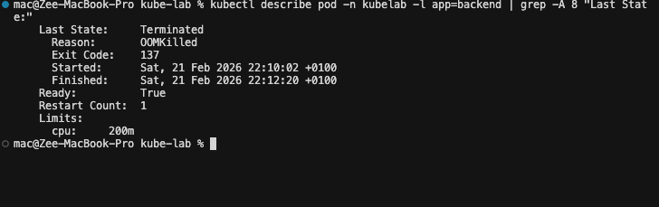

# Memory Stress (OOMKill)

Allocates memory inside a backend pod in 50MB chunks until it crosses its 256Mi limit. The Linux kernel sends SIGKILL. Pod restarts. The other backend replica serves traffic throughout.

**Before clicking**: open a terminal:
```bash
kubectl get pods -n kubelab -l app=backend -w
```

## What You'll See

```
NAME                      READY   STATUS    RESTARTS
backend-6d4f8b9c7-xk2qp  2/2     Running   0
backend-6d4f8b9c7-xk2qp  0/2     OOMKilled 0          ← kernel killed it
backend-6d4f8b9c7-xk2qp  2/2     Running   1          ← restarted
```

## Find the Evidence

```bash
kubectl describe pod -n kubelab <backend-pod> | grep -A 8 "Last State:"
```



```
Last State:  Terminated
  Reason:    OOMKilled
  Exit Code: 137
```

Exit 137 = 128 + 9 (SIGKILL). The Linux kernel's OOM killer sent SIGKILL directly to the process — not Kubernetes. Kubernetes only observed the exit code and labeled it OOMKilled.

To see the last output before the kill (no shutdown message — SIGKILL leaves no time for cleanup):

```bash
kubectl logs -n kubelab <backend-pod> --previous
```

The log stream stops mid-line. That abrupt cutoff is the OOMKill signature in logs.

## Why No Graceful Shutdown?

SIGKILL cannot be caught, blocked, or handled by any process. There is no `preStop` hook, no cleanup. The kernel doesn't negotiate — it terminates instantly. This is why OOMKills cause data loss in apps that buffer writes in memory.

## CPU vs Memory Limits

| | CPU limit hit | Memory limit hit |
|--|--------------|-----------------|
| What happens | Throttled (CFS freezes process periodically) | OOMKilled (SIGKILL) |
| Pod restarts? | No | Yes |
| Exit code | — | 137 |
| Visible in kubectl top? | Appears at ceiling | Pod disappears briefly |

## Production Insight

Slow memory leak pattern: pod runs fine for 8 hours → OOMKill → restart → repeat. RESTARTS climbs overnight. No one notices because CPU and memory metrics look normal between crashes.

Alert on restart rate:
```promql
rate(kube_pod_container_status_restarts_total{namespace="kubelab"}[1h]) > 3
```

Debug a leak:
```bash
kubectl top pod -n kubelab    # watch memory grow over time
kubectl logs <pod> --previous # see what was happening before the kill
```

**Back**: [CPU Stress ←](cpu-stress.md) · **Next**: [DB Failure →](database.md)

