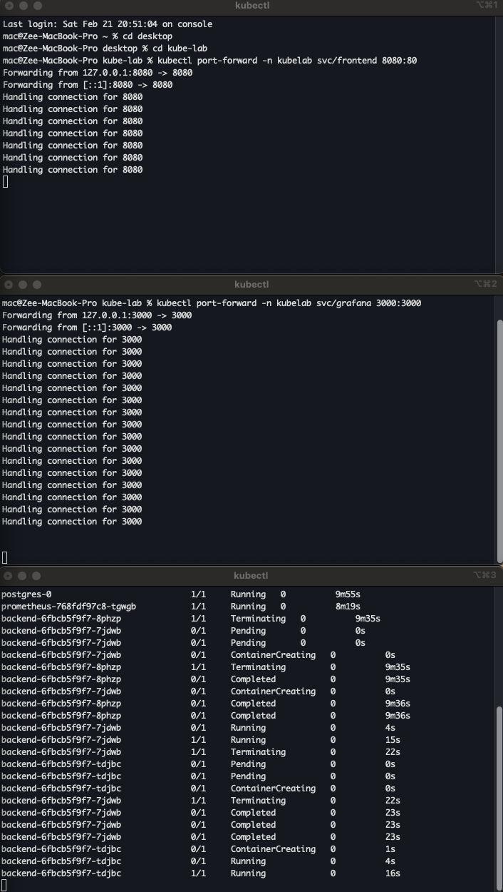

# Kill Pod

Deletes a running backend pod via the Kubernetes API. Kubernetes recreates it within 10 seconds.

**Before clicking**: open a terminal and run:
```bash
kubectl get pods -n kubelab -l app=backend -w
```

## What You'll See



```
NAME                       READY   STATUS        RESTARTS
backend-6d4f8b9c7-xk2qp   2/2     Running       0
backend-6d4f8b9c7-xk2qp   2/2     Terminating   0       ← deleted
backend-6d4f8b9c7-n7mw3   0/2     Pending       0       ← new pod
backend-6d4f8b9c7-n7mw3   0/2     ContainerCreating
backend-6d4f8b9c7-n7mw3   2/2     Running       0       ← healthy
```

Name changed. That's a different pod — pods are immutable objects. Kubernetes never modifies them, only replaces them.

## What Happened

1. You called DELETE on the pod via the Kubernetes API
2. API server set `deletionTimestamp` on the pod object in etcd
3. Endpoints controller removed the pod from the Service load balancer **immediately** (before SIGTERM)
4. ReplicaSet controller noticed actual=1, desired=2 → created a replacement in parallel
5. Scheduler placed the new pod on an available node
6. Kubelet pulled the image, started the container, ran the readiness probe
7. Once readiness passed, Endpoints controller added the new pod back

## Verify

```bash
# See the full control-plane event sequence
kubectl get events -n kubelab --sort-by=.lastTimestamp | tail -10
# Killing → SuccessfulCreate → Scheduled → Pulled → Started

# Confirm new pod is serving traffic
kubectl get endpoints -n kubelab backend-service
```

## Production Insight

High RESTARTS = investigate why pods are dying, not the replacement itself.

```bash
kubectl describe pod -n kubelab <pod-name> | grep -A 5 "Last State:"
# OOMKilled (exit 137) → memory limit too low or memory leak
# Exit 1 → application crash, check logs
```

Alert on: `rate(kube_pod_container_status_restarts_total[15m]) > 0.1`

**Next**: [Drain Node →](node-drain.md)

